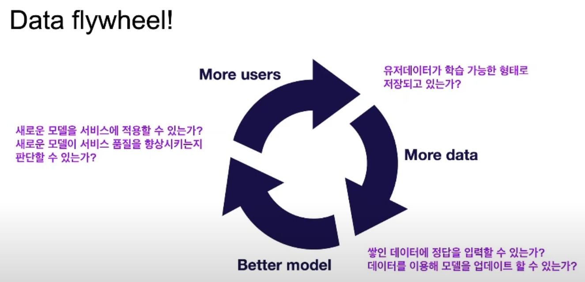

AI 기술을 적용하기 위한 프로세스

데이터 수집, 라벨링 -> 모델링 -> 배포

연구용 코드를 대용량 트래픽을 감당하기에 적합한 코드로 수정
모델 버젼 관리 및 배포 자동화

SaaS의 한계점
- 데이터 보안
- 제한적인 커스터마이즈
- Data Flywheel 형성의 부재 : 데이터가 증가함에 따라, 모델의 성능이 좋아지고, 서비스 품질이 향상됨에 따라 유저들이 증가한다. 데이터를 통한 선순환 고리
 